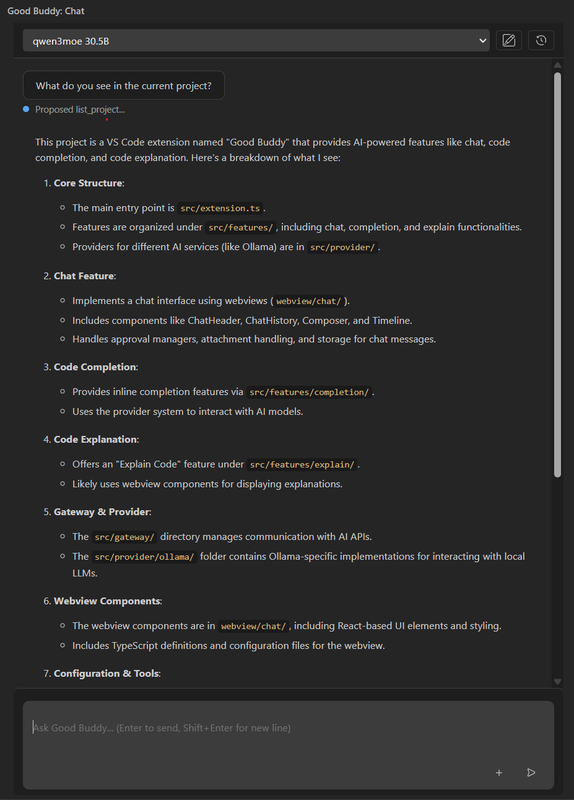

# Good Buddy, an alternative to GitHub Copilot


**Your coding assistant, powered by the model server you choose. Compatible with OpenAI-compatible servers.**

Good Buddy brings AI chat, code explanations, inline completions, and hands-on
project tools into VS Code. Use [LM Studio](https://lmstudio.ai/),
[llama.cpp](https://github.com/ggml-org/llama.cpp)'s OpenAI-compatible server,
[Open WebUI](https://openwebui.com/) with its OpenAI-compatible API, or
[Ollama](https://ollama.com/). OpenAI-compatible servers share one integration,
so you can use many local and remote endpoints without a provider-specific
extension.

Keep your code on your own infrastructure: Good Buddy sends requests to the
server you configure and does not require a Good Buddy cloud service.



## What you can do

- **Chat with your project in context.** Ask questions about your codebase,
  explore how things work, or get help planning an implementation.
- **Ask about images.** Attach PNG, JPEG, or WebP files, or paste a screenshot
  into the chat composer. Image understanding depends on whether your selected
  model supports vision; text-only models may reject image requests.
- **Make changes with the assistant.** Ask it to add a feature, update existing
  behavior, or fix a bug. Good Buddy can inspect files, propose edits, and run
  project commands. Review proposed file changes in a diff and approve them
  before they are applied; commands also require confirmation.
- **Understand code faster.** Select code and ask Good Buddy to explain it.
- **Get inline code completions.** Receive ghost-text suggestions as you type,
  using a model you select for completion.
- **Work with the model server that fits your setup.** Choose Ollama or an
  OpenAI-compatible API such as LM Studio, llama.cpp, or Open WebUI.
- **Stay in control.** Workspace tools are scoped to the opened workspace;
  file changes and shell commands are shown for approval.

## Usage

Try prompts like:

- “Add a settings page for changing the theme. First inspect how settings work
  in this project.”
- “Find where this error is handled and explain the flow.”
- “Update the parser to support trailing commas, then run the relevant tests.”

Open **Good Buddy** from the Activity Bar to chat. Use the **Models** button in
the chat toolbar to configure your provider and select chat and completion
models. Select code and run **Good Buddy: Explain Selected Code** for a focused
explanation. Inline completions appear as you type when enabled.

## Contributing

Contributions are welcome! Please open issues or submit pull requests on the [GitHub repository](https://github.com/farzad-bagheri/good-buddy).

## Installation

Good Buddy defaults to the OpenAI-compatible provider. Choose Ollama instead
from the Good Buddy settings if that is your preferred server.

1. Choose and start a supported model server:
   - For Ollama, [install Ollama](https://ollama.com/download) and make sure it's running (`ollama serve`, or the desktop app's background service).
   - For LM Studio, start its local server and enable its OpenAI-compatible API.
   - For llama.cpp, run its server with the OpenAI-compatible API enabled.
   - For Open WebUI, configure its OpenAI-compatible connection to a model
     server. The server's URL and API key depend on your setup.
2. Make at least one model available to the server. For Ollama, pull models such as:

   ```sh
   ollama pull qwen2.5-coder:7b
   ollama pull qwen3:8b
   ```

3. Install/enable the Good Buddy extension in VS Code, then open **Settings** and configure it under **Good Buddy** (search `goodBuddy`):
   - `goodBuddy.provider` — defaults to `openai-compatible`; choose `ollama` to use Ollama instead.
   - `goodBuddy.endpoint` — Ollama server URL. Defaults to `http://localhost:11434`.
   - `goodBuddy.openAICompatibleEndpoint` — OpenAI-compatible API base URL,
     including `/v1` when required. Defaults to LM Studio's
     `http://localhost:1234/v1`.
   - `goodBuddy.openAICompatibleApiKey` — optional authentication key for servers that require API-key authentication.
   - Use the **Models** button in the chat toolbar to check the server and
     choose chat and inline-completion models. Choices are saved independently
     for each provider and endpoint.
   - `goodBuddy.inlineCompletionsEnabled` — toggle ghost-text completions on/off (also available via the **Good Buddy: Toggle Inline Completions** command).
   - `goodBuddy.maxContextLines` — how many lines of surrounding code to send with each completion request.
   - `goodBuddy.completionTimeoutMs` — how long to wait for a completion before giving up; raise this if you use a larger model or have slower hardware.

   When changing provider or endpoint, Good Buddy loads that connection's
   saved model selections. If either choice is missing or unavailable, choose
   a model from the server's current list in the Models dialog.

For an OpenAI-compatible server, choose model IDs returned by its `/models`
endpoint in the Models dialog. The server must support `/chat/completions`;
chat uses JSON response formats for the assistant's structured tool protocol.
Inline completion requests are sent as user prompts to the chat-completions
endpoint, so model behavior can differ from Ollama's native fill-in-the-middle
endpoint. Ensure your selected model server supports the API features Good
Buddy uses, as compatibility can vary.

### Ollama model suggestions

If using Ollama, pick models sized for your hardware; smaller models respond faster and are a better fit for inline completions where latency matters. Select downloaded model IDs in the Models dialog.

**Completion** — code-focused models are recommended:

- [`qwen2.5-coder:7b`](https://ollama.com/library/qwen2.5-coder) — good balance of speed and quality, recommended default.
- [`qwen2.5-coder:1.5b`](https://ollama.com/library/qwen2.5-coder) — fastest option, best for low-resource machines.
- [`codellama:7b-code`](https://ollama.com/library/codellama) — alternative code-focused model.

**Chat / explanations**:

- [`qwen3:8b`](https://ollama.com/library/qwen3) — a good general-purpose reasoning option.
- [`llama3.1:8b`](https://ollama.com/library/llama3.1) — widely used general-purpose alternative.
- [`deepseek-r1:7b`](https://ollama.com/library/deepseek-r1) — stronger reasoning if you don't mind slower responses.

Browse the full catalog at [ollama.com/library](https://ollama.com/library) for other sizes/quantizations that fit your hardware.

## Project layout

- `src/extension.ts` registers VS Code commands and providers.
- `src/config.ts` is the single place that reads extension settings.
- `src/features/chat/` contains the chat webview and its lifecycle.
- `src/features/completion/` contains inline-completion behavior.
- `src/features/explain/` contains selected-code explanation behavior.
- `src/provider/` contains the provider abstraction and Ollama/OpenAI-compatible implementations.
- `src/gateway/` contains the HTTP request helpers.
- `out/` is generated JavaScript. Do not edit it directly.

## Develop

1. Install dependencies with `pnpm install`.
2. Start your configured model server and ensure the configured models are available.
3. Run `pnpm run watch`, then launch **Run Good Buddy Extension** from VS Code.

Run `pnpm run check` and `pnpm run lint` before committing. Use `pnpm run build` to create a production bundle.

## Testing

This project now includes a Vitest-based unit-test setup for fast validation and coverage reports.

- Run unit tests with `pnpm test`
- Re-run automatically while editing with `pnpm test:watch`
- Generate a coverage report with `pnpm coverage`

The test suite uses mocked fetch responses for provider HTTP calls so you can verify request/response handling without a live model server.

## License

Good Buddy is available under the [MIT License](LICENSE). You may use it for
personal or commercial purposes, modify it, and redistribute it, subject to
the license terms.

Attribution or citation is appreciated but not required. If Good Buddy is
useful in your research, software, or commercial work, you can use the
metadata in [CITATION.cff](CITATION.cff) or cite it as **Good Buddy** by the
Good Buddy contributors.

## Troubleshooting chat

The chat view reports the response body when a provider returns malformed JSON rather than presenting an opaque parse error. Check the **Good Buddy** output channel for model-listing failures, and verify the endpoint setting for the selected provider.

## Workspace tools

Ask the chat to inspect the project, read files, implement a feature, fix a bug,
or run a command. Good Buddy provides workspace tools to:

- Browse project files and search filenames or file contents.
- Read files and inspect VS Code diagnostics or symbol references.
- Propose exact-section edits or complete file contents. Review each unified
  diff and choose **Approve** or **Reject**; approval verifies the file has not
  changed since the proposal was created.
- Run project commands after confirmation, with output shown in chat.
- Move a selected workspace file to the OS trash only after its own explicit
  confirmation.

Each request starts with the opened workspace path and a compact project tree.
Tool paths are scoped to the workspace, command output is capped, and each
agent request is limited to five tool calls. Good Buddy proposes and assists
with changes; you remain in control of applying edits and running commands.

Use **Attach** in the chat footer to add up to five text files (80 KB each) to the next message. Selected filenames appear beneath the composer. Attachments are sent only with that next message and are then cleared; binary and oversized files are not attached.
